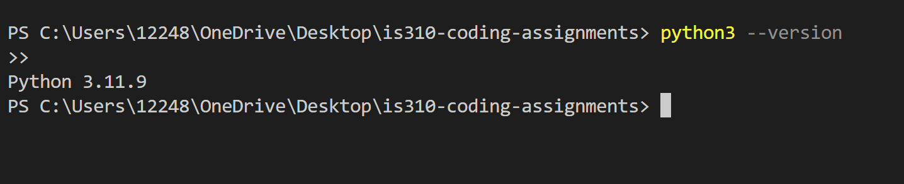
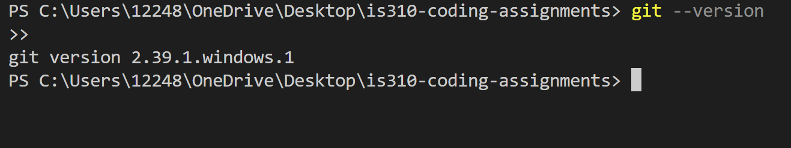

# Init IS310 Homework

## Proof of Installation

1. Python

2. Git

3. VS Code

4. AI Tool/Workflow 

How will you work with AI? What tools if any do you plan to use?

I have OpenAI's Codex in my VSCode IDE enabled, as well as copilot. I only ever plan to use them for their auto-complete features, which essentially serve as a helper to complete my line of code instead of manually typing everything out. I don't plan to ever use it as a generation tool for assigments. 
